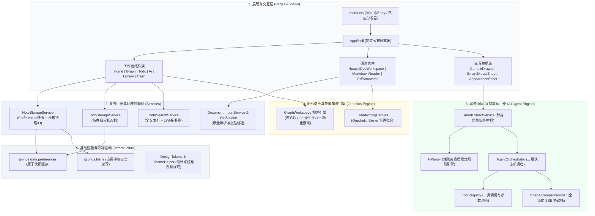
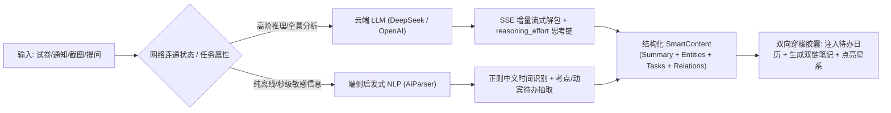

# FlowMind 墨语 · 技术栈全景与核心架构白皮书 (TECH STACK)

> **定位**：FlowMind（墨语）纯血鸿蒙端侧 AI 驱动个人信息工作台与双链知识库架构深度解析。  
> **版本**：v1.0.0 (API 11 / API 12 NEXT)  
> **组织仓库**：[RETEMPT/moyu](https://github.com/RETEMPT/moyu)

---

## 1. 核心设计原则与架构哲学

FlowMind 的工程实现遵循三大不可动摇的底层原则：

1. **Local-First（本地优先）**：
   - 用户的所有笔记、考点摘录、待办规划、手写墨水与双链索引 100% 留存在端侧私有沙箱内；
   - 零强制上云、零隐蔽遥测、零第三方商业追踪 SDK，守护学术与个人隐私资产。
2. **Deterministic UI / UX（确定性极简体验）**：
   - 摒弃玩具化彩色 Emoji，全面推行高对比度中性灰阶与精密几何拓扑排版符号（`←`、`▤`、`✎`、`⊡`、`✦`、`▦`、`⛶`）；
   - 采用单调有界缓动曲线与硬件级防撕裂规范，杜绝 GPU 光栅化混合中的视口跳变与边缘折光。
3. **Multi-device Adaptive（全端自适应响应式体系）**：
   - 针对 MatePad 系列平板采用“三栏式常驻 + 伴读分屏 + 多页并列”；
   - 针对 Mate / Pura 手机竖屏采用“防溢出工具流 + 沉浸式底栏抽屉 + 自动紧缩”；
   - 保证一套核心业务逻辑驱动全场景设备形态。

---

## 2. 技术栈全景矩阵 (Technology Stack Spectrum)

| 维度 | 选型 / 规范 | 版本 / 标准 | 说明与核心价值 |
| :--- | :--- | :--- | :--- |
| **操作系统** | HarmonyOS NEXT | API 11 / API 12 | 纯血鸿蒙底层，全面迁移至 Stage 统一应用模型 |
| **主开发语言** | ArkTS | 5.0+ | 严格静态类型安全约束，零动态 `eval` 隐患，高性能 JIT/AOT |
| **UI 声明式框架** | ArkUI | Declarative Paradigm | 组件化声明式渲染、细粒度 `@State` / `@Prop` / `@Link` 状态驱动 |
| **构建流水线** | Hvigor + ohpm | 4.x / 5.x | 模块化构建、声明式依赖解析、秒级增量编译与 HAP/HSP 打包 |
| **手写图形渲染** | ArkUI Canvas 2D | Hardware-Accelerated | 二次贝塞尔光滑拟合、硬件压感支持、笔控触控分离防误触 |
| **关系引力图谱** | 自研力导向物理引擎 | Force-Directed 2D | 库仑静电斥力 + 胡克弹性引力 + 阻尼动能衰减 + 虚拟质心聚类 |
| **三层 AI 智能体** | AgentOrchestrator | Multi-tier Architecture | L1 伴读助手、L2 学情教练、L3 跨库检索与全自动调度 |
| **大模型流式适配** | OpenAiCompatProvider | Server-Sent Events (SSE) | 支持 DeepSeek R1/V3（含 `reasoning_effort` 思考链）、OpenAI、Qwen、Moonshot |
| **端侧 NLP 规则引擎** | AiParser (自研启发式) | Local Heuristic Regex | 离线中文时间抽取、考点摘要归纳、任务动宾短语提炼，0ms 网络依赖 |
| **文档与原盘引擎** | HuaweiDoc + PDF Kit | Multi-page A4 Layout | 虚拟化多页物理排版、归一化矢量笔迹落盘、随堂分屏稿纸 |
| **持久化与存储** | 沙箱 I/O + Preferences | Hybrid Local Storage | Preferences 毫秒级首屏快照 + 沙箱 `.md` / `.json` 物理文件原子化落地 |
| **安全合规规范** | HarmonyOS Code-Linter | Security & Perf Plugin | 静态阻断弱密码算法、内存安全泄漏监控、私有沙箱权限按需申请 |

---

## 3. 核心分层架构设计 (Layered Architecture)

FlowMind 采用单向向下依赖架构，自顶向下分为五大系统：

---

## 4. 关键子系统技术揭秘

### 4.1 端侧 AI 智能体与混合双模引擎 (Smart Agent Engine)

- **三层智能体职能划分**：
  - **L1 伴读助手（Document Companion）**：上下文限定在当前研读文档与草稿纸，负责考点释疑、段落精炼与公式转写；
  - **L2 学情教练（Learning Analyst）**：汇总近 7 天待办完成率、错题高频标签与遗忘曲线，给出自适应复习规划；
  - **L3 跨库中枢（Cross-Vault Orchestrator）**：全局双链检索与跨文档知识综合，自动发现隐藏概念脉络。
- **动态工具调用沙箱（`ToolRegistry`）**：
  - 支持向大模型注入 `search_notes`、`get_note_content`、`create_todo`、`query_graph_relations` 等标准化 JSON Schema；
  - 拦截模型 Function Call 返回，在端侧安全执行后将状态回传模型，形成自主智能体推理循环。

### 4.2 矢量手写墨水与笔触分离引擎 (Vector Ink & Palm Rejection)

- **笔触与触控分离（Touch & Pen Separation）**：
  - 利用系统 `SourceTool` 识别手写笔（Stylus/Pencil）与手指接触；
  - 手写笔专享高刷新率采样，手指默认触发双指缩放（Pinch）与视口平移（Pan），实现硬件级防误触（Palm Rejection）；
- **二次贝塞尔曲线平滑（Quadratic Bézier Fitting）**：
  - 对实时采样的原始坐标序列采取中点插值法动态构建 Bézier 曲线：
    $$B(t) = (1-t)^2 P_0 + 2t(1-t) P_1 + t^2 P_2, \quad t \in [0, 1]$$
  - 彻底抹平折线断层感，并以微米级相对坐标归一化落盘，确保在不同分辨率鸿蒙设备上无损矢量缩放。

### 4.3 星系知识图谱引力场物理仿真 (Force-Directed Graph Simulation)

在 `GraphWorkspace.ets` 中，FlowMind 构建了一套纯 ArkTS 实现的高性能二维粒子物理系统：

1. **库仑静电斥力（Coulomb Repulsion）**：任意两节点之间产生逆距离平方的排斥力，保持节点间距舒展：
   $$\vec{F}_{\text{rep}}(u, v) = \frac{k_{\text{rep}}}{d(u, v)^2} \cdot \hat{r}_{uv}$$
2. **胡克弹性引力（Hooke Spring Tension）**：存在双链关联的节点间产生拉伸引力，维系知识聚类：
   $$\vec{F}_{\text{att}}(u, v) = k_{\text{att}} \cdot (d(u, v) - L_0) \cdot \hat{r}_{vu}$$
3. **质心与多标签聚类引力（Cluster Centroid Gravity）**：具有相同标签（如 `#考研`、`#数学`）的节点被施加朝向局部标签质心的微引力；
4. **阻尼动能衰减（Damping & Velocity Verlet）**：每帧施加 $\gamma \approx 0.88$ 速度衰减系数，确保物理系统在 120 帧内自然收敛停滞，实现 60 FPS 丝滑拖拽手感。

### 4.4 华为风全屏原盘研读工作台 (HuaweiDocWorkspace)

- **A4 物理分页排版**：打破常规长卷滚动的阅读疲劳，将长文或试卷以标准 A4 页面比例（$\sqrt{2} \approx 1.414$）切分虚拟分页；
- **分屏草稿演算纸**：右侧呼出全高随堂稿纸，左看试题右写演算，稿纸笔迹与当前文档元数据绑定存储；
- **非破坏性退出三态拦截**：在退出时自动拦截并呈现“保存并退出”、“放弃修改”、“取消”三态弹窗，杜绝手滑导致笔迹丢失。

---

## 5. 安全体系与质量保障

1. **零敏感数据硬编码**：全库经过严格的安全审查，API 凭据仅在端侧私有存储中按需管理；
2. **HarmonyOS Code-Linter 规范**：
   - 启用 `@security/no-unsafe-aes`、`@security/no-unsafe-hash` 等顶级安全规则；
   - 启用 `@performance/recommended` 性能检查规则；
3. **工程构建验证**：
   - 产物通过 `build_hap.bat` 严格校验，确保在 HarmonyOS NEXT 统一 Stage 模型下 100% 编译通过；
   - 提供标准化部署脚本 `deploy_hap.bat`，支持真机与模拟器快速验证。

---

## 6. 核心文档与工程索引

- [项目概览与快速开始 (`README.md`)](./README.md)
- [项目全景记忆、GPU渲染避坑与稳定性约定 (`PROJECT_MEMORY.md`)](./PROJECT_MEMORY.md)
- [开源贡献指南与规范 (`CONTRIBUTING.md`)](./CONTRIBUTING.md)
- [安全策略与隐私规范 (`SECURITY.md`)](./SECURITY.md)
