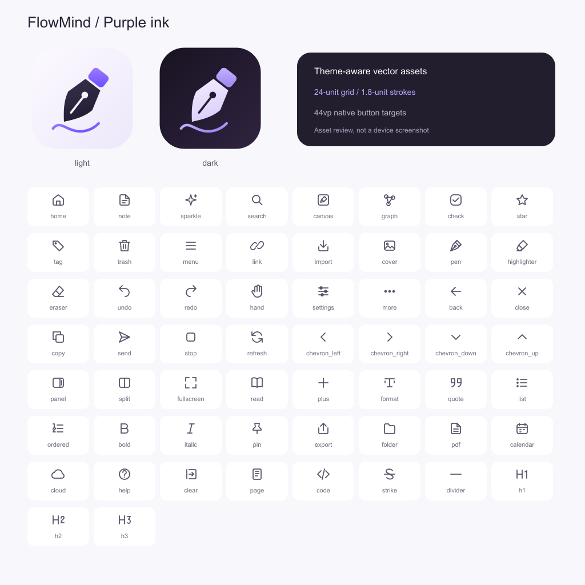

# 墨语图标规范

v1.0.3 使用重绘的应用图标、60 个工具资源和统一纸张文档封面。应用标记使用斜向笔尖、紫色笔帽与墨迹，提供浅色、深色和启动器前景/背景；工具使用统一 SVG 描边。生成器输出 67 份向量资产（工具、品牌母版及总览）。



该图是源资产预览，不能作为设备界面截图或真机验收证据。

- 工具网格为 24 × 24，描边为 1.8，端点与连接为圆角。默认显示 20vp，按钮触控区至少 44vp。
- `AppIcon` 使用 `Image.fillColor` 跟随主题；`IconButton` 提供原生提示、无障碍名称、选中与禁用状态。
- 常用操作以图标为主，首页、编辑/批注/格式工具补充短标签；二级菜单与确认保留明确名称。带标签按钮为 56vp，纯图标至少 44vp；横向滚动避免窄屏挤压。
- 狭窄手写工具栏可以横向滚动，颜色/笔粗折叠在设置图标中；笔、荧光笔、橡皮擦、撤销、重做始终位于一级工具栏。

生成向量资源与母版：

```powershell
node tools/generate-ui-icons.mjs
node tools/generate-ui-icons.mjs --check
```

生成 PNG：

```powershell
node tools/generate-icons.mjs --sharp-module "<sharp 模块目录>"
```

也可使用生成器已有的浏览器光栅化路径。启动器 PNG 为 1024px；品牌及启动图为 512px，资产预览为 1024px。修改图标时先更新生成器，再重新生成；CI 校验向量资源是否一致。
