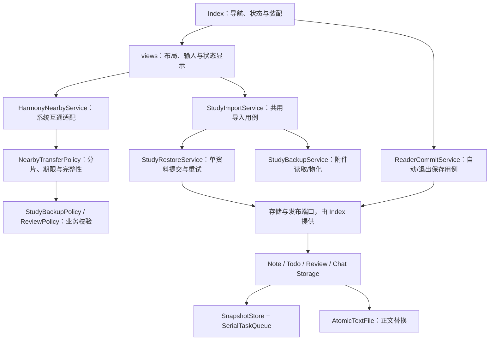

# 分层架构与数据保存

更新：2026-10-06。当前采用渐进迁移，保留现有服务路径和 JSON 格式；不把一次目录改名当作完成全部架构重构。

## 本轮下沉的职责

| 边界 | 负责 | 不负责 |
| --- | --- | --- |
| 视图 | 用户选择、数量预览、忙碌/失败状态、关闭 | 附件校验、整批恢复规则、密钥转移 |
| ReaderCommitService | 排队自动与退出提交、各编辑区只修改自己负责的字段，保留分类/封面/索引等最新数据，存储成功后发布 | ArkUI、设备发现、全文搜索 |
| StudyImportService | 文件/附近来源共用校验、稳定恢复 ID、题卡映射、进度与局部失败说明 | 图标、布局、系统文件选择器实现 |
| NearbyTransferPolicy | 不可变传递清单、分片/Unicode、摘要、期限与支持版本 | 系统权限和组网、直接修改本地资料 |
| HarmonyNearbyService | 用户授权、可信设备、加密临时 KV、单目标同步、结果/超时/资源清理 | 课程内容政策、自动覆盖正文、云服务 |
| SnapshotStore | 排队 put/flush，捕获 JSON，损坏/读失败阻止覆盖，失败恢复缓存 | 跨文件事务、凭证加密、云一致性 |
| AtomicTextFile | 临时文件完整写入、fsync、关闭后同目录 rename，失败保留目标 | 快照与正文的联合事务、外部 URI 导出 |

队列失败后可以继续处理后续任务。对话的读—修改—写也排成一个操作，防止并发保存两段会话只留下其中一段。正文写入队列由进程内各实例共享，避免使用同一临时路径的竞态。

快照保持原 Preferences 键和值格式，不需要升级时清库。合法空资料库保持空，不重新填示例。格式异常与读取失败会保留原数据并阻止继续覆盖；目前没有自动修复损坏快照的界面，恢复前先保留设备数据。原始可读正文可通过已有文件能力找回，但不能据此声称所有元数据可自动重建。

## 仍然存在的边界

- Index 仍持有新建、分类、收藏、回收站和部分 AI 操作，尚未完成所有用例拆分；下一步按实际操作迁移到统一工作区仓储，覆盖所有修改入口的并发控制。
- 正文与 Preferences 是分步骤持久化。写入临时文件可以保护旧正文，缓存回滚可以避免后续 flush 带入失败值，但二者并非联合事务；断电后的最终状态仍需真机核对。后续评估事务数据库加提交日志和恢复流程。
- 阅读器用例队列覆盖自动与退出保存；跨其他工作区操作的共同事务仍需统一仓储。不要据此宣称全应用并发无丢失。
- 备份恢复按每份资料提交；题卡失败保留有效资料，按稳定 ID 重试补齐。整批不是原子事务。附近传递只返回经校验的备份，确认导入后才调用同一恢复流程。
- 模型配置仍在私有 Preferences，尚未接入专用密钥保护；系统应用备份范围仍待验证。临时传递库的加密不等于所有应用数据均加密。

## 后续迁移规则

新增业务用例通过明确端口读取、持久化和发布状态，不直接引用 ArkUI 页面；纯策略放在领域服务，系统 API 只放适配服务；common 只保留类型、常量与无平台工具。继续沿用现有 `pages → views/services → common` 依赖方向，服务不能反向导入视图。

先迁移资料修改/删除用例并引入统一仓储，再增加逐实体同步版本和附件目录。每次迁移保持现有可观察行为，验证失败路径与旧数据读取；不同时重写导航、模型协议和存储格式。页面装配仅保留事件到用例、状态发布与导航，逐步减少 Index 的业务代码。

质量证据分开记录：纯规则/平台替身测试、ArkTS/资源/应用包构建、真实手机与 Pad 系统功能和性能。前两项通过不能替代最后一项。候选架构与范围见 [多设备计划](MULTIDEVICE_PLAN.md)。
