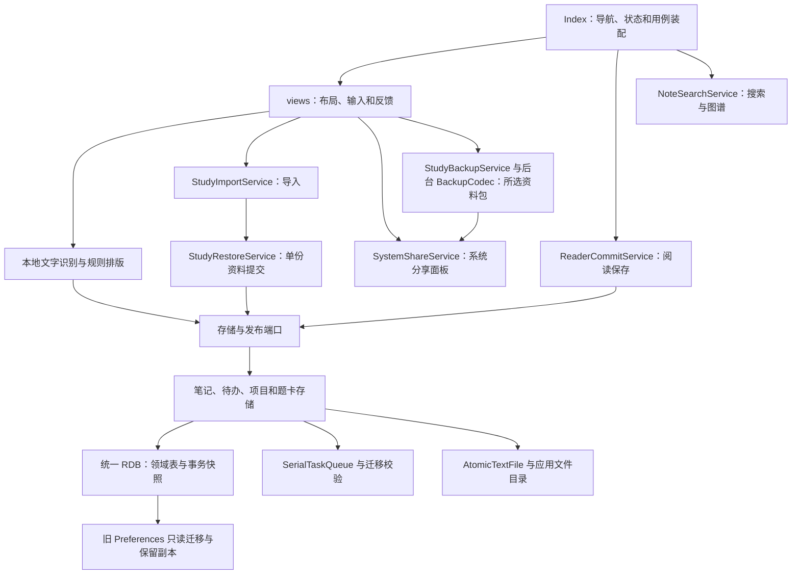

# 当前分层架构与数据保存

更新：2026-10-22。当前版本为 1.1.1（1010001），本地复习增强属于主应用；离线结果准备层尚未启用，产品范围以 [声明](../PRODUCT_SCOPE.md) 为准。本文描述本地功能、持久化和去中心化同步方向；开发入口见[指南](DEVELOPMENT_GUIDE.md)，新增收费网站／公开资料库与云 AI 见[独立规划](WEB_PLATFORM_PLAN.md)，不属于当前运行架构。

```mermaid
flowchart TD
  Page[Index：导航、状态和用例装配] --> View[views：布局、输入和反馈]
  View --> Extract[本地文字识别与规则排版]
  Page --> Reader[ReaderCommitService：阅读保存]
  Page --> Search[NoteSearchService：搜索与图谱]
  View --> Import[StudyImportService：导入]
  View --> Share[SystemShareService：系统分享面板]
  Import --> Restore[StudyRestoreService：单份资料提交]
  View --> Backup[StudyBackupService 与后台 BackupCodec：所选资料包]
  Backup --> Share
  Restore --> Ports[存储与发布端口]
  Reader --> Ports
  Extract --> Ports
  Ports --> Storage[笔记、待办、项目和题卡存储]
  Storage --> Rdb[统一 RDB：领域表与事务快照]
  Rdb --> Legacy[旧 Preferences 只读迁移与保留副本]
  Storage --> Snapshot[SerialTaskQueue 与迁移校验]
  Storage --> Files[AtomicTextFile 与应用文件目录]
```

## 职责边界

`cloud/ai/` 是独立 Python 实验模块，不在上图应用依赖中。它按 `CLI → Tutor → Store / Provider` 划分，`sources.py` 提供确定性文本分块和词面检索；Store 使用专用 SQLite 标识与 schema=1，不迁移应用 RDB。Tutor 处理有界任务状态、资料／记忆快照、引用核验、编辑采纳及独立文件导出。当前没有跨端调用、服务端账号或共享数据层，详见[运行说明](../cloud/ai/README.md)。

主程序的本地学习投影由 `LearningProgressPolicy` 提供：依据当前分类、阅读记录和题卡最近反馈生成概况，排除已删除及缺失来源，按显式时间排列到期题。StudySheet 复用现有 ReviewStorageService 保存题卡，内容编辑保留身份、来源、复习次数与日期；无需字段迁移。此纯策略可在后续单独授权的适配中复用，但当前没有云端端口或业务入口。

`pages/Index.ets` 持有当前工作空间状态并装配端口；`views` 通过属性和回调展示状态；`services` 提供纯策略、用例和系统能力适配；`common` 保存类型、常量、主题与无平台工具。下层不反向引用视图。

自由白板、手写笔记、PDF 和图片复用 HuaweiDocWorkspace 的工具栏、工具设置和保存出口。InkCanvasSurface 共用纸纹、已保存笔迹、实时笔迹三层画布及触摸／尺寸／就绪事件；HandwritingCanvas 保留世界坐标笔迹适配，PdfPageCanvas 保留页内归一化坐标适配。原文件背景由各自适配器负责；共用组件不读取或改写原件，不迁移旧笔迹格式。

识别与排版拆为 OcrService、DocumentExtractService、SourceTextStructure、LocalTextFormatter、ExplicitTaskExtractor 和 SmartCaptureService。文件提取有页数与字数限制；排版只依据原文结构，保存前验证所选日期。普通文字导入与备份恢复是不同入口。

## 持久化

应用启动显式启用 RdbSnapshotRepository。NoteStorageService 的资料、项目、回收站统一通过 readCollection／writeCollection：旧快照先校验后复制到数据库，后续读取以数据库为准；SQL 事务同时替换分片、目录和已迁移标记，缺片或目录损坏时阻止覆盖。64K 字符分片分别 JSON 编码，避免 Unicode 代理对跨边界损坏，且不触及平台单行 2MB 限制。旧 Preferences 和原文件不删除；数据库提交后尽力更新旧恢复副本，不能用该副本无提示降级。笔记、项目和回收站仍是兼容旧结构的事务快照；待办、日期备忘、题卡和随手记草稿已迁入同库独立字段表及查询索引，旧 Preferences 仅用于读取迁移。全面领域关系化和按需正文装载未完成。schema 为 2，未来版本数据库会被拒绝打开。

SnapshotStore 捕获提交快照并排队 put／flush；损坏或读取失败时阻止后续空值覆盖。AtomicTextFile 完整写入临时文件、同步、关闭后替换正文；失败保留原目标。队列失败后仍可处理后续任务。

ReaderCommitService 在提交时读取最新资料，只修改当前编辑区负责的字段，避免把其他区域的新封面、笔迹、标签或分类回退。图谱和搜索以请求代次及不可变资料快照隔离晚到结果。

NoteSnapshot 显式复制 NoteItem 字段，独立复制 tags 数组；正文和笔迹字符串共享不可变值，避免保存入口对整份资料反复 JSON 编解码。字段覆盖检查防止扩展类型时漏掉快照字段。手写与 PDF 的退出保存等待在途自动保存；当前修订已落盘时直接完成，失败或有新修订则重试，失败仍保留当前资料和脏状态。仅笔迹、稿纸或阅读位置变化不重建文字图谱，文字与标题变化仍刷新。

自由白板进出使用 100ms 淡入淡出且无位移，其他文档仍使用 200ms 轻位移；减少动态设置沿用全局动画规则。该调整削减代码路径中的额外等待，不表示测得设备帧率或消除全部未响应。

阅读提交与笔记修改共用 Index 的变更队列；入队前复制输入，避免等待期间输入被后续编辑改变。`reading` 提交只合并 `lastReadAt`／`readPage`，不改编辑时间、正文或笔迹，不重建图谱。PDF 翻页合并 600ms 内的变化，退出等待在途提交；旧阅读事件不能回退较新位置。资料库显示设置由 LibraryPreferencesService 独立持久化，提交成功才发布。

LibraryPolicy 统一主页／资料库的类型、标签和排序；资料库正文搜索涵盖已装载正文与经过校验的 PDF 页文字。全库高级搜索继续由 NoteSearchService 负责。ReadingProgressPolicy 处理页码边界和真实最近阅读，无阅读记录不制造继续阅读条目。详见 [Koodo 改造记录](KOODO_REFERENCE.md)。

参考 Memos 拆分 QuickMemoService 和 MemoDraftService：草稿独立于笔记快照，500ms 合并保存，Index 页面隐藏时提交待写草稿；正式保存进入同一笔记变更队列，正文和元数据成功后才发布。稳定草稿 ID 避免清稿失败后再次保存产生副本；碰到已保存但正文不同的同 ID 记录时拒绝覆盖。失败遗留的正文保留供重试，不以清理为由删除可能有用的数据。时间流只是现有 Markdown 资料的创建时间视图，无重复数据库。进程强制退出前的最后输入、跨文件断电恢复仍需要对应验证。

InkShapePolicy 将直线、矩形、椭圆与箭头生成普通点路径，两个坐标适配器共用策略；抬笔提交一条笔迹，取消不提交，继续兼容历史撤销、擦除与备份。paperStyle 和 scratchpadPaperStyle 分别由手写／稿纸提交拥有，备份只接收 blank、ruled、grid。底纹不进入笔迹数据。

自由白板由 WorkspaceNotePolicy 的专用 ID 识别，创建时等待正文与元数据落盘；已有普通画布、同名笔记及回收站 ID 不被复用或覆盖。空白正文跳过空字符串编码和零字节 write，但仍创建临时文件、fsync、关闭并原子替换。

正文文件与 RDB 仍分步骤保存，不是联合事务。跨文件断电恢复日志、完整持久化整理草稿和全领域原子用例仍是后续工程；不能据当前串行队列宣称全应用无丢失。

## 同步现状与方向

当前 1.1.1 没有账号、中心服务或自动同步；跨设备只使用显式附近传递和文件备份，HAP 不含网络服务二进制。规划中的网站账号、订单和公开库属于独立可选服务，不改变当前本地基线。

下一代按去中心化设计：设备密钥（Ed25519／HUKS）标识设备，配对交换公钥并派生资料库密钥；资料、附件和同步元数据端到端加密；操作日志／版本向量／CRDT 在本地合并冲突；传输层使用附近／局域网、用户自有 WebDAV／S3／网络文件夹，以及未来可选的无账号加密中继。分享使用能力链接和密钥轮换，恢复使用恢复密钥，不依赖服务端 ACL 或账号。该方向尚未实现，不能把设计写成已完成。

## 导入、恢复与传递

PDF 先保存应用内副本，再提交元数据，重启后按当前沙箱目录恢复路径。系统选择器默认使用包含全部支持扩展名的过滤分组，避免首项 Markdown 过滤隐藏 PDF；每批最多 20 份，逐份复制与解析。资料导入最终提交进入笔记变更队列，使用提交时的最新资料列表，避免覆盖等待期间已保存的编辑。每份持久化成功才发布，失败只清理本轮副本，已成功资料保留；项目内导入沿用当前分类。备份恢复按单份资料提交，局部失败可重试；整批不是原子事务。快传按现有文件夹分类与排序，支持整夹选择、部分选择、展开逐份勾选；空文件夹不展示。分组复用 WorkspaceBuilder，文件夹和展开后的文件分别分批显示；选择整夹包含尚未渲染的文件。打包保留原分类，接收后仍按原分类归档。再经系统分享面板选择设备，接收方在应用中选择收到的资料包并确认导入副本。移除自建分布式数据库、传递码、设备权限与轮询；系统分享面板打开不表示交付成功。

NoteStorageService 启动时以最多 4 个读取任务按原顺序装载正文，单份读取失败阻止空正文覆盖。DocumentSourcePolicy 只核验快照中的精确原件路径／文件名；已有本机副本只做可读性检查，不启动 PDF 解析。确需迁移的旧 URI 先复制、验证，快照持久化后才发布新引用，失败清理本轮副本并保留批注。

PDF Kit 为原生路径；缺少能力时新增 LocalPdfEngine 和单个隐藏 ArkWeb 宿主使用离线 PDF.js。按需范围读取、两份文档缓存及页面位图上限用于控制大文件开销；这条兼容路径尚待设备运行验证。调试预渲染仍只接受与内置两份样本逐字节一致的文件，release 排除调试样本，不能以预渲染冒充真实课本内容。

学习备份只导出所选资料明确允许的正文、原件、封面、笔迹、校对文字和关联题卡字段；不复制任意私有字段、绝对文件路径、待办或回收站。BackupCodec 使用 TaskPool 执行 JSON 编解码与包校验，附件 Base64 编解码走异步 API，文件按最多 512 KB 分块写入。资料包总量上限 32 MB、单个附件 16 MB；缺失附件或不完整读写会明确失败。系统分享使用缓存目录内专属文件的 file URI 和 JSON UTD，下一次快传清理超过 24 小时的专属缓存，不在面板刚打开时删除接收方可能正在读取的文件。

## 验证

学习结果交换采用独立 v1 文件契约：Python 负责导出已采纳且未过期的结果，原生 `LearningResultPolicy` 仅解析、校验并在指定片段完全匹配时生成 `ReviewDraft`。这两份类型／策略文件被明确列为未启用的准备模块，生产引用图不可达，范围与架构测试同时约束；没有传输、存储或 UI 接线。协议、共享样本与保存前条件见[接入准备](LEARNING_INTEGRATION.md)。

系统 OCR、物理笔与附近传递取决于对应系统能力和设备。附近传递为用户主动确认的资料副本，不是全库自动同步；分享面板打开不表示送达。1.1.1 客户端没有互联网权限；去中心化同步尚未接入。

质量证据分别记录纯逻辑与平台适配替身、SDK编译后交互、构建及真实手机／平板能力；前几项不替代设备验证。方法见[开发指南](DEVELOPMENT_GUIDE.md)、[本地排版规则](LOCAL_TEXT_LAYOUT.md)和[设计规范](DESIGN_REVIEW.md)，实际运行记录本地保存。

## 记录时间线与视觉

首页视觉以 Notion 为主，记录行为保留 Memos 的本地方式；HomeWorkspace 不绑定资料库显示模式；文字记录、日期及标签筛选由 MemoFeedPolicy 统一派生。Index 持有日期／标签筛选并连接 AppShell → HomeWorkspace → MemoCalendar，成功保存后清除日期和标签过滤。只有本机 Markdown 记录进入时间线，PDF／图片／手写仍在资料库；项目树全局可达，日期和标签通过首页筛选打开。时间流只渲染有界纯文本摘要，长文排版在阅读器中执行。主题入口统一纸面底色，强调色沿用原设置。

## 2026-10-18 代码检查与修复

项目删除／恢复由 WorkspaceLifecycle 生成不可变计划，资料、项目、回收站、项目回收记录在同一 SQL 事务提交，成功后刷新侧栏。未分类资料不自动生成侧栏文件夹，备份仍包含其分组。重命名、移动、收藏、置顶、标签和校对文字共用变更队列，失败不发布新状态。稿纸省略号已接通真实菜单和独立目标命令。

Markdown编辑提供选区命令、有界差量历史、源码／预览、固定滚动区、快捷键及在途保存等待。待办添加等待持久化，失败保留输入。DomainStorage迁移待办／日期备忘／题卡／草稿到同一数据库，校验缺失目录和记录摘要；旧快照保留且不再跟随更新。完整跨文件崩溃恢复和按需加载仍未完成，不能将这些机制等同于绝对无丢失。

ReaderSplitWorkspace 统一文件标签、拖到右半边的放置区、通用分屏选择和跨两篇文档的保存等待。每块区域复用对应的 ReaderWorkspace（Markdown 与原有目录／双链）或 HuaweiDocWorkspace（PDF／图片／手写与随堂稿纸），非当前标签只保留身份，不创建隐藏阅读器。各区域以文档 ID 和请求序号回报保存，拒绝重复及过期回调，任一失败保留页面；阅读进度由对应原件阅读器等待落盘。支持同格式及不同格式组合，不扩充实际格式引擎。原来的 PDF 专用 Markdown 分屏已移除，分屏仅由外层协调。键盘避让由 Index 页面持有，两个文字区域不会互相恢复窗口设置。

CanvasStrokeLoader 通过 TaskPool 解码及验证非空笔迹；画布使用私有笔迹数组，不为逐点数据建立声明式状态。加载结果校验文档身份和加载代次；关闭或换资料后迟到的结果不发布。空稿纸只绘制纸纹，跳过离屏位图；尺寸为空、非有限值或未显著改变时不重复重绘。取消分屏宽度／滑入动画，减少复杂 PDF 在尺寸过渡中的反复布局。未修改的加载中稿纸可直接关闭并保留原字节。绘制仍由主线程执行，大库读取及复杂墨迹的实际耗时仍需设备验证。

PDF耗时解析、渲染与批量文字提取由NativePdfTask在TaskPool执行，同文件串行、全局最多两份文件。兼容引擎使用单个ArkWeb宿主，范围桥接、资源响应及Base64使用异步接口，大回包后台解析；初始化等待原生确认并对未绑定代理重试。最多三页独占位图缓存，读取前核对原件大小和修改时间，切换格式按实际位图类型回收，关闭后清理缓存。兼容栅格化上限960×1440／JPEG0.85，原生路径上限1200×1800；这些是实现限制，不是设备性能测量。共享文件标签为唯一标题栏，文档操作位于批注栏菜单。
